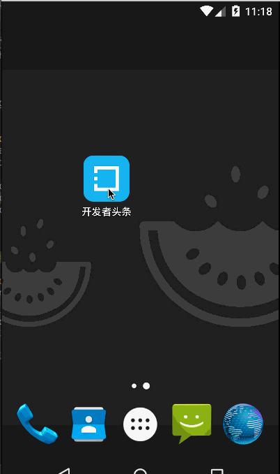

# DevHeadLine
高仿开发者头条，高仿程度尽量逼真真实，目前完成了初步的UI，我打算整体架构采用主流的MVP设计模式，网络请求采用Retrofit2+RxJava，
图片采用Fresco，如果用到数据库的话采用Realm，总之，尽量采用目前主流框架和设计模式！！！

# 效果图

# 修改日期
* 16/3/15 添加MVP、fresco
* 16/3/16 添加Retrofit2.0

# TODO

1. 构建MVP
2. 抓包开发者头条数据
3. 其他 
